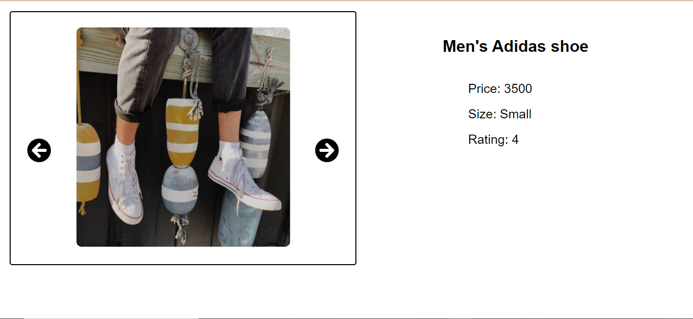

## Used technology stack
NodeJS | ReactJS | MySQL

## Repository consists of 3 directories
1. client - consists of the scripts related to the front end (ReactJS)
2. server - consists of the scripts related to the back end(NodeJS)
3. dbScripts - consists 3 sql scripts and an image that shows the ERD of the database
* db.sql - database creation
* tablesCreation.sql - create tables
* dataInsertion.sql - insert dummy data to the database

## Steps to run the program

1. Setup a connection to MySQL database and run the database scripts in the following order
db.sql
tablescreation.sql
dataInseertion.sql

2. Run the backend server
* Go to "srver -> configurations -> config.js" and set database configurations and port
* Open a terminal in the directory ./server and run following commands to install dependencies
`
npm install cors
npm install mysql
npm install express 
`
* Run the followin command to run the server
`
npm start
`

3. Run the front end
* Go to "client -> src -> configurations -> config.js
* Open a terminal in the directory ./client and run following commands to install dependencies
`
npm install axios
npm install mysql
npm install react
npm install react-dom
npm install react-icons
npm install react-router-dom
npm install react-scripts
npm install web-vitals
`
* Run the followin command to run the client
`
npm start
`
## Home page

## Product page

## Database design
